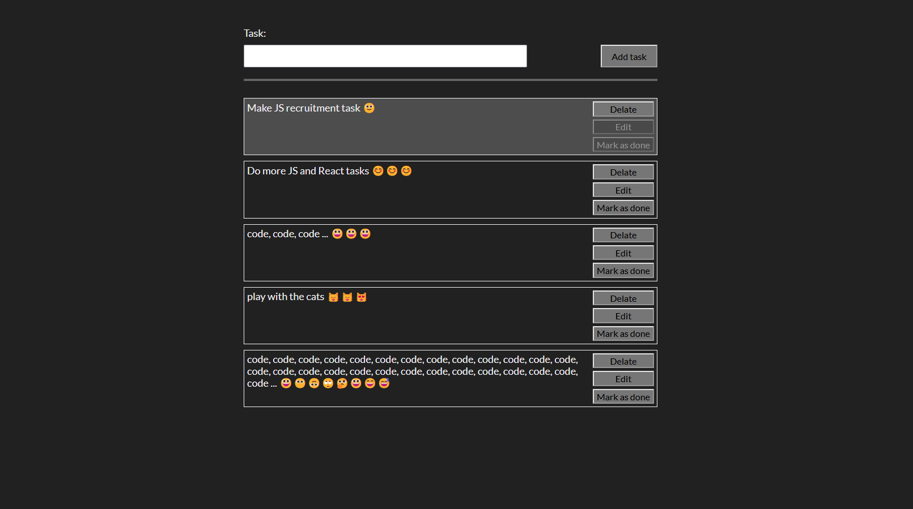

# Task manager - JS recruitment task

## Overview

This is a simple, user-friendly to-do list application, designed to help manage
daily tasks efficiently. Created using pure JavaScript, HTML, and SCSS, this app
offers a visually pleasing interface without relying on heavy frameworks or
libraries.

## Features

- Add Tasks: Easily input new tasks to the list.
- Edit & Delete: Each task comes with options to edit its content or delete it
  entirely.
- Mark as Complete: With a simple click, tasks can be marked as completed. These
  tasks are then visually distinguished from the rest
- Persistent Storage: Thanks to the use of localStorage, your tasks are stored
  in the browser's memory. This ensures that your data remains intact even after
  refreshing the page.
- Responsive Design: The application is designed to be used on various screen
  sizes without compromising the user experience.

## Bonus Features

- Interactive UI: The application features smooth CSS animations for adding,
  editing, or deleting tasks, providing an enhanced user experience.
- Task Filtering: Allows users to filter the displayed tasks based on their
  status - completed, pending, or all tasks.

## Dependencies

This application is built using pure JavaScript, HTML, and SCSS. There are no
external dependencies.
